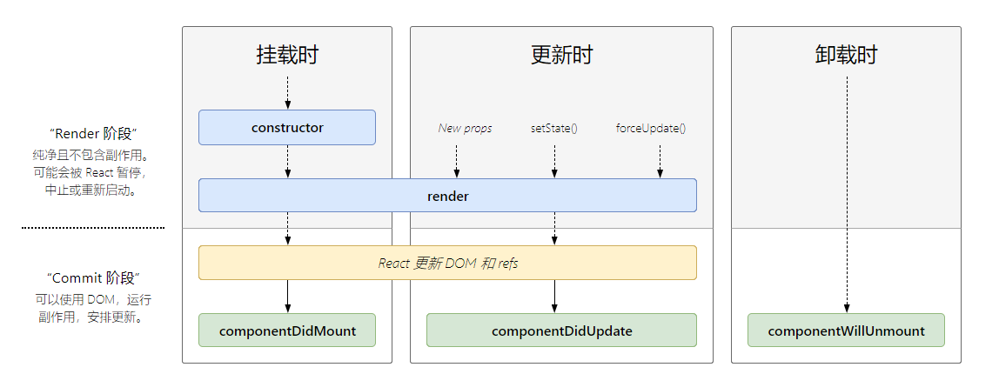

# 2020-01-02
## jsx
- jsx 可以像模板一样绑定变量与使用函数
```
//变量使用
var params = '1';
var jsx = <h1>params: {params}</h1>;
ReactDOM.render(
  jsx,
  document.getElementById('root')
);


//函数使用
var func = function(str){
    return 'this is my function ' + str;
var jsx =  <h1>func: {func('fff')}</h1>
};
ReactDOM.render(
  jsx,
  document.getElementById('root')
);

```

## [React 组件生命周期](http://projects.wojtekmaj.pl/react-lifecycle-methods-diagram/)

